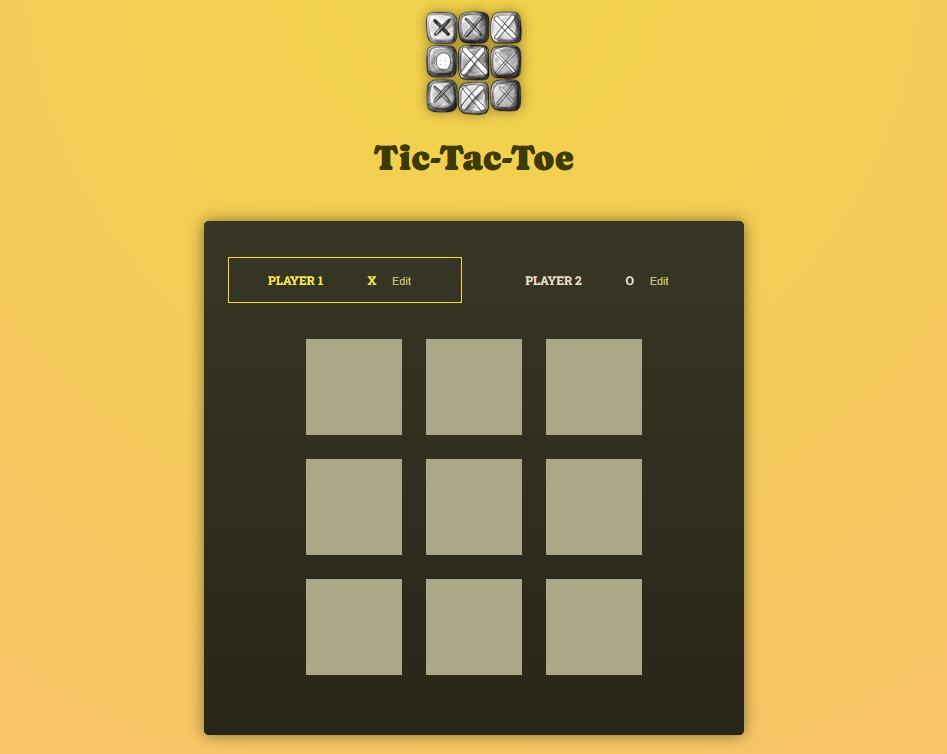

# DevFlow


[](https://tic-tac-toe-gamma-roan.vercel.app/)
[](LICENSE)



## 🌐 Demo

Here is a working live demo: https://tic-tac-toe-gamma-roan.vercel.app/

## 📝 Description

This is a classic Tic-Tac-Toe game implemented using React. It allows two players to take turns marking squares on a 3x3 grid, with the goal of getting three of their marks in a row, column, or diagonal. The game includes features like tracking turns, identifying a winner, and allowing for a rematch.

## 📖 Table of Contents

- [🌐 Demo](#-demo)
- [📝 Description](#-description)
- [✨ Features](#-features)
- [💻 Technologies Used](#️-technologies-used)
- [🛠️ Setup Project](#-setup-project)
  - [🍴 Prerequisites](#-prerequisites)
  - [🚀 Install Project](#-install-project)
- [🤝 Contributing and Support](#-contributing-and-support)
  - [⚒️ How to Contribute](#️-how-to-contribute)
  - [📩 Bug Report](#-bug-report)
- [📞 Contact Me](#-contact-me)
- [📋 License](#-license)

## ✨ Features

👉 **Two-Player Gameplay**: Players can take turns marking 'X' or 'O' on the board.

👉 **Winner Detection**: Automatically identifies and declares the winner when a player gets three in a row.

👉 **Draw Detection**: Handles cases where the game ends in a draw.

👉 **Turn Logging**: Keeps a log of all moves made during the game.

👉 **Player Name Editing**: Allows players to customize their names.

👉 **Rematch Functionality**: Provides a button to easily restart the game.

## 💻 Technologies Used

- [![React.js][React.js]][React-url]
- [![JavaScript][JavaScript]][JavaScript-url]
- [![HTML5][HTML]][HTML-url]
- [![CSS3][CSS]][CSS-url]
- [![Vite][Vite]][Vite-url]

[React.js]: https://img.shields.io/badge/react-%2320232a.svg?style=for-the-badge&logo=react&logoColor=%2361DAFB
[React-url]: https://react.dev/
[JavaScript]: https://img.shields.io/badge/javascript-%23323330.svg?style=for-the-badge&logo=javascript&logoColor=%23F7DF1E
[JavaScript-url]: https://developer.mozilla.org/en-US/docs/Web/JavaScript
[HTML]: https://img.shields.io/badge/html5-%23E34F26.svg?style=for-the-badge&logo=html5&logoColor=white
[HTML-url]: https://developer.mozilla.org/en-US/docs/Web/HTML
[CSS]: https://img.shields.io/badge/css3-%231572B6.svg?style=for-the-badge&logo=css3&logoColor=white
[CSS-url]: https://developer.mozilla.org/en-US/docs/Web/CSS
[Vite]: https://img.shields.io/badge/vite-%23646CFF.svg?style=for-the-badge&logo=vite&logoColor=white
[Vite-url]: https://vite.dev/

## 🛠️ Setup Project

To get this project up and running in your development environment, follow these step-by-step instructions.

### 🍴 Prerequisites

We need to install or make sure that these tools are pre-installed on your machine:

- [Node.js](https://nodejs.org/en)
- [Git](https://git-scm.com/downloads)
- [npm](https://www.npmjs.com/) (Node Package Manager)

### 🚀 Install Project

1. Clone the Repository

```bash
git clone https://github.com/janrizmlibres/tic-tac-toe.git
```

2. Install packages in the project directory

```
npm install
```

3. Run the development server

```bash
npm run dev
```

## 🤝 Contributing and Support

### ⚒️ How to Contribute

Want to contribute? Great!

To fix a bug or enhance an existing module, follow these steps:

- Fork the repo
- Create a new branch (`git checkout -b improve-feature`)
- Make the appropriate changes in the files
- Add changes to reflect the changes made
- Commit your changes (`git commit -am 'Improve feature'`)
- Push to the branch (`git push origin improve-feature`)
- Create a Pull Request

### 📩 Bug Report

If you find a bug, kindly open an issue [here](https://github.com/janrizmlibres/tic-tac-toe/issues/new) by including a description of your problem and the expected result.

## 📞 Contact Me

[
](https://www.linkedin.com/in/janrizlibres/)

## 📋 License

[MIT](https://choosealicense.com/licenses/mit/)
Released 2025 by Janriz Libres @janrizmlibres
